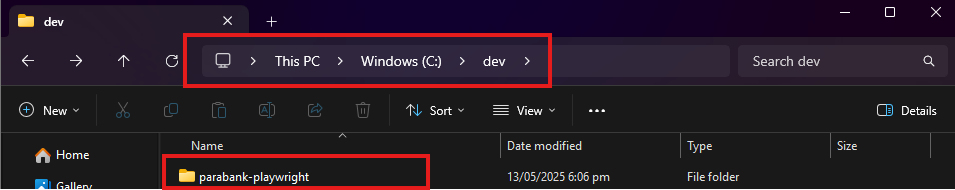

# parabank-playwright
This is a fully-functional automation project repository which allows the user to transact end-to-end testing in parabank application.

Click [here](https://playwright.dev/docs/intro) for Playwright's official documentation.

_Take note of the project's pre-requisite before running the automation locally_:

- [Node.js](https://nodejs.org/en/download)
- [Java JDK 17](https://www.oracle.com/java/technologies/javase/jdk17-archive-downloads.html)
- [Jenkins](https://www.jenkins.io/download/)
- Use the following command to install dotenv for safekeeping of senstive informations like credentials, api keys and endpoints
```cmd
npm install dotenv

- Make sure to ask a copy of .env file from author and copy it inside the cloned project folder
- Make sure to clone the project repository in this file path

```cmd
C:\dev



## Author

Jeric Al P. Fernandez  
📧 fernandez.jerical3@gmail.com  
📱 +63 995 387 9865  
💼 Software Development Engineer in Test (SDET)